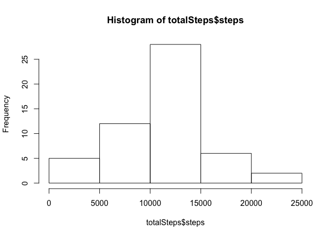
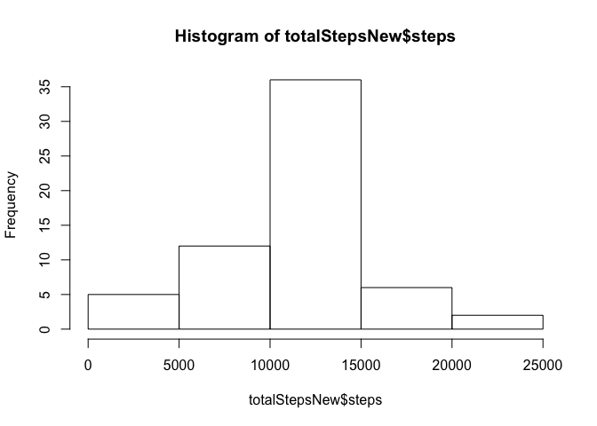
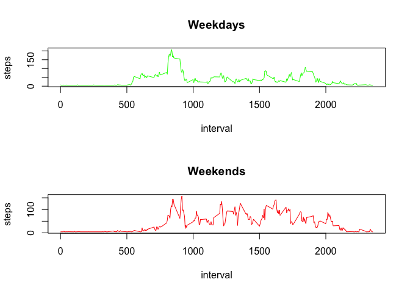

# Reproducible Research: Peer Assessment 1

## Loading and preprocessing the data


```r
data <- read.csv("activity.csv")
totalSteps<-aggregate(steps~date,data=data,sum,na.rm=TRUE)
```

## What is mean total number of steps taken per day?

Make a histogram

```r
hist(totalSteps$steps)
```

<!-- -->

Calculate the mean and median total number of steps taken per day

```r
mean(totalSteps$steps)
```

```
## [1] 10766.19
```

```r
median(totalSteps$steps)
```

```
## [1] 10765
```
The mean of number of steps taken per day is 1.0766189\times 10^{4} steps.
The median of total number of steps taken per day is 10765 steps.

## What is the average daily activity pattern?

Time-series plot of the average number of steps taken during each 5-minute interval during the day

```r
stepsInterval<-aggregate(steps~interval,data=data,mean,na.rm=TRUE)
plot(steps~interval,data=stepsInterval,type="l")
```

<!-- -->

Which interval, on average contains the maximum number of steps? 

```r
stepsInterval[which.max(stepsInterval$steps),]$interval
```

```
## [1] 835
```

## Imputing missing values

Calculate and report the total number of missing values in the dataset

```r
sum(is.na(data$steps))
```

```
## [1] 2304
```
Total 2304 rows are missing

Devise a strategy for filling in all of the missing values in the dataset. Make a histogram of the total number of steps taken each day and Calculate and report the mean and median total number of steps taken per day

```r
newData <- data
newData[is.na(newData[,1]), 1] <- mean(newData[,1], na.rm = TRUE)

totalStepsNew<-aggregate(steps~date,data=newData,sum)
hist(totalStepsNew$steps)
```

<!-- -->

```r
mean(totalStepsNew$steps)
```

```
## [1] 10766.19
```

```r
median(totalStepsNew$steps)
```

```
## [1] 10766.19
```
Mean value is same as before because we replaced the NAs with the mean value for that particular 5-min interval. Median value shows a little difference

## Are there differences in activity patterns between weekdays and weekends?

Create a new factor variable in the dataset with two levels – “weekday” and “weekend” indicating whether a given date is a weekday or weekend day.

```r
newData$day <- as.POSIXlt(newData$date)$wday
newData$dayType <- as.factor(ifelse(newData$day == 0 | newData$day == 6, "weekend", "weekday"))
newData <- subset(newData, select = -c(day))
```

Make a panel plot containing a time series plot (i.e. type = “l”) of the 5-minute interval (x-axis) and the average number of steps taken

```r
weekdaysData <- newData[newData$dayType == "weekday",]
weekendsData <- newData[newData$dayType == "weekend",]
stepsIntervalWeekdays <- aggregate(steps ~ interval, weekdaysData, mean)
stepsIntervalWeekends <- aggregate(steps ~ interval, weekendsData, mean)

par(mfrow = c(2, 1))

plot(stepsIntervalWeekdays, type = "l", col = "green", main = "Weekdays")
plot(stepsIntervalWeekends, type = "l", col = "red", main = "Weekends")
```

<!-- -->
